# REPORT(Grade 3 Track)
Achilles Feratidis
## 1. Design  Log

**Initial Idea & Intended Audience:**
I wanted to make a simple one-page portfolio to show to potential employers. At first, I just thought about making it look like a basic online CV that links to my GitHub, and I wanted to build it from scratch.
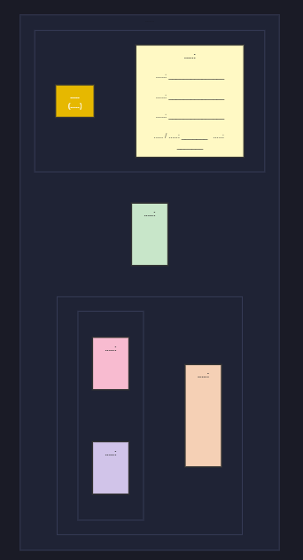

**Design Changes:**
To make it look better, I changed a few things:
1. **Card Layout:** I changed the background to gray and put my content inside white boxes with soft shadows so it's easier to read.
2. **Header/Footer:** I made the top and bottom dark blue so they stand out more.
3. **Interactive Links:** Instead of boring underlined links, I used CSS hover and focus states so the colors flip when you point at them. They feel more like real buttons now.
4. **Responsiveness:** I added CSS media queries so the menu stacks up nicely when you look at it on a phone.

**Evidence:**
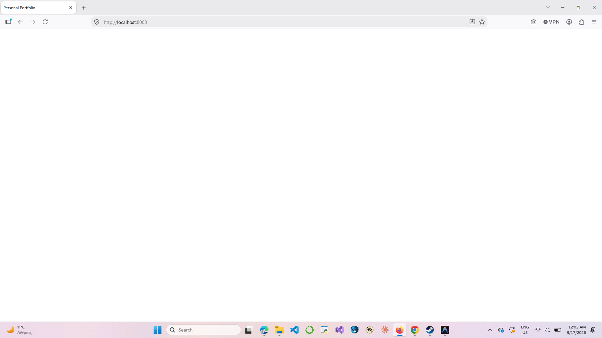
*Just the basic HTML setup on my local server.*

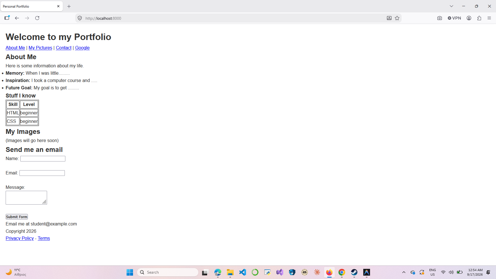
*Adding the main semantic HTML tags to structure the page.*

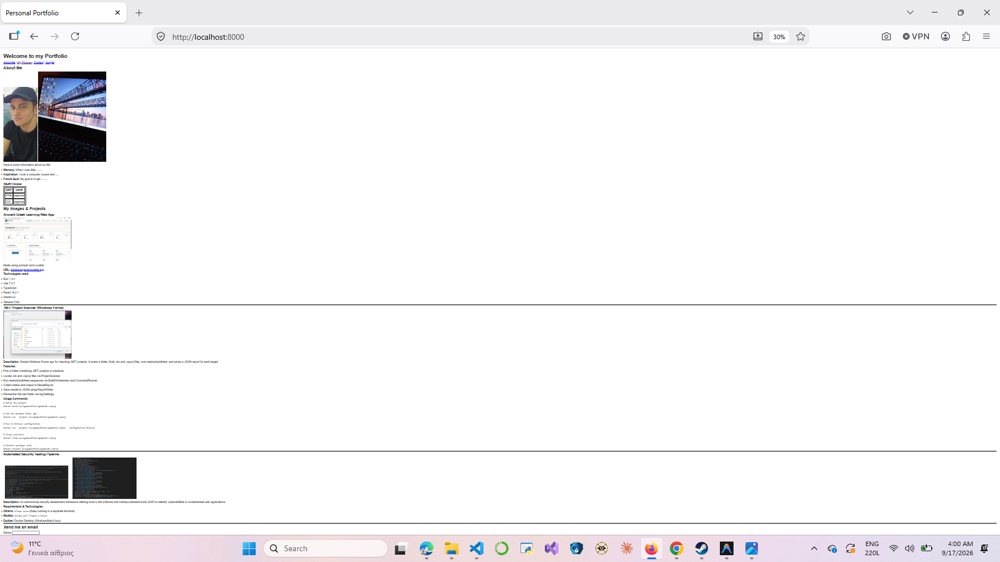
*Putting in my photos and adding alt text.*

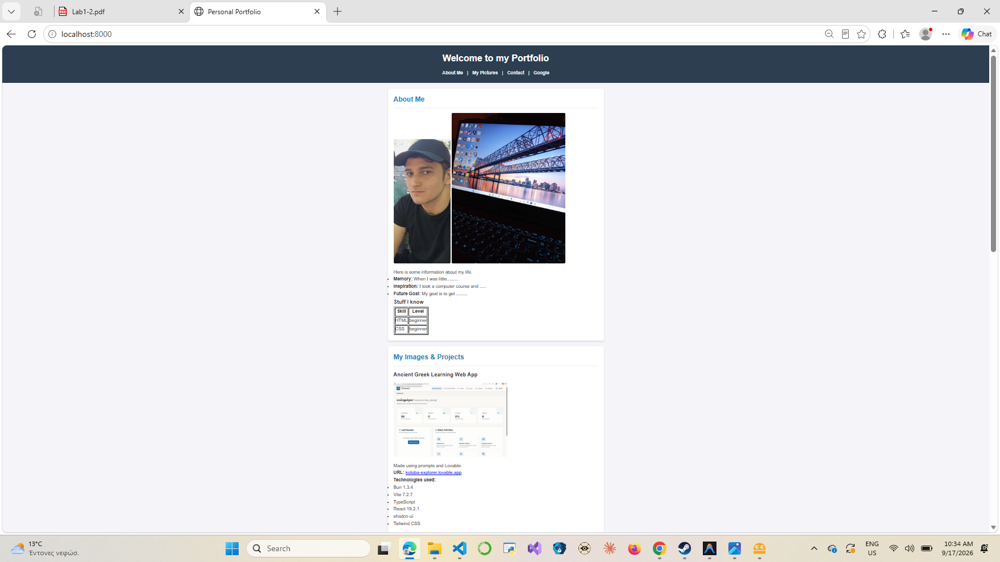
*Adding some basic CSS padding and margins.*

*The hover states flip the colors.*
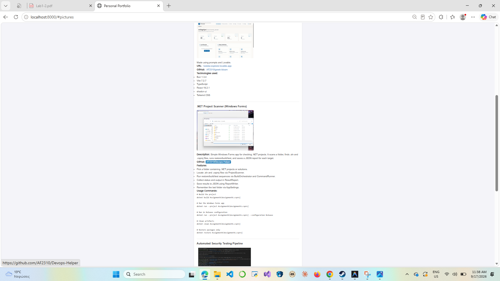
*Testing the tab key to make sure you don't need a mouse.*

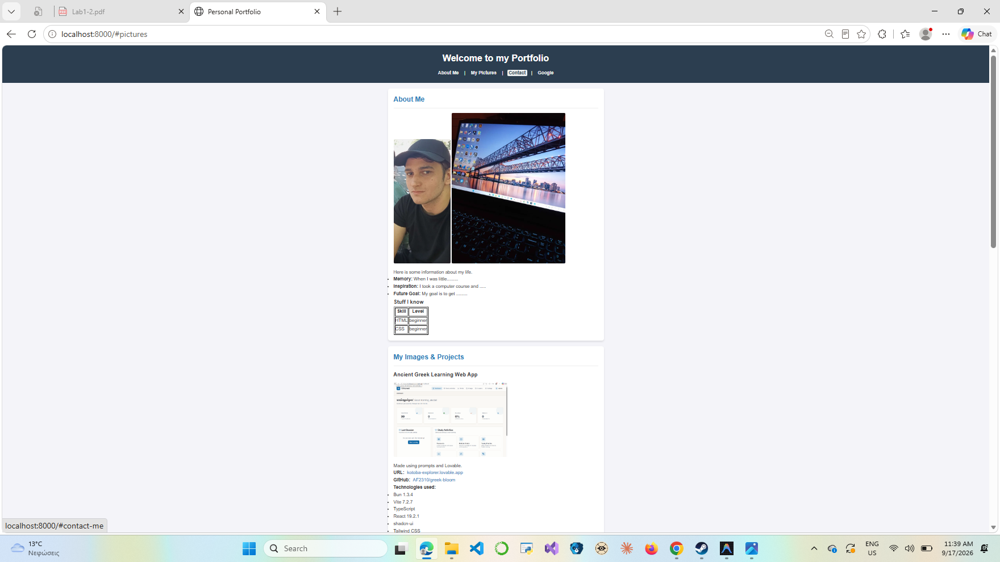
*Adding the hover effects to the footer.*

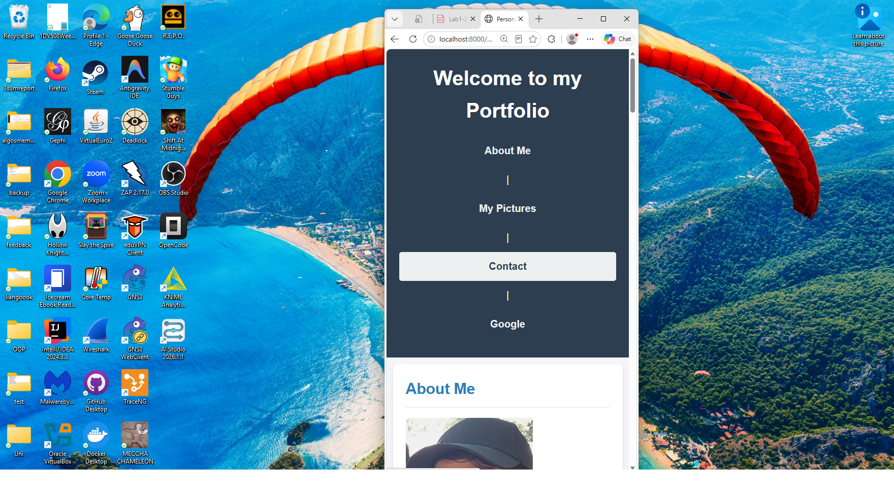
*Testing the media queries on a smaller screen.*

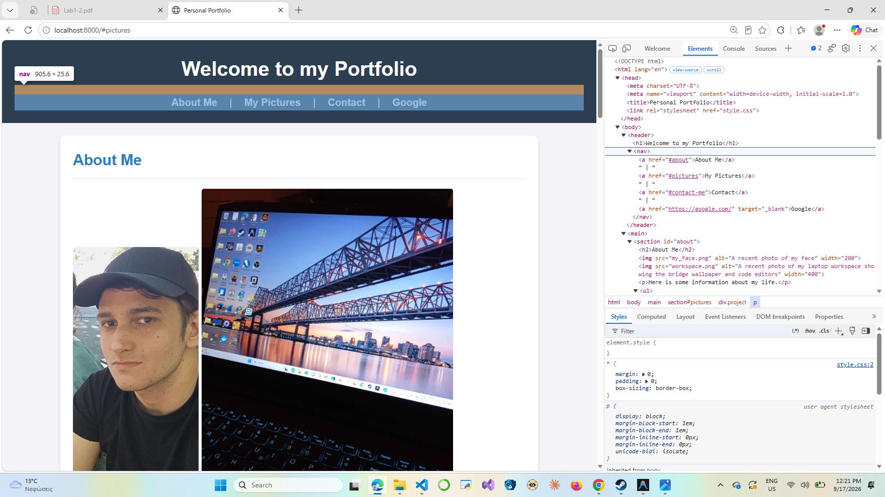
*Using Chrome DevTools to fix my CSS box model.*

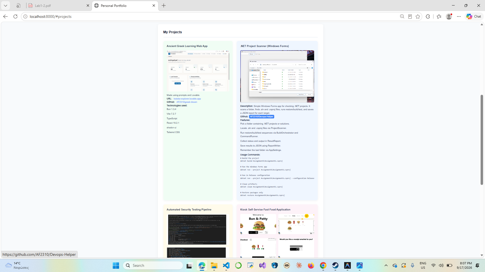
*Using CSS Grid to make a 2x2 layout for my projects.*

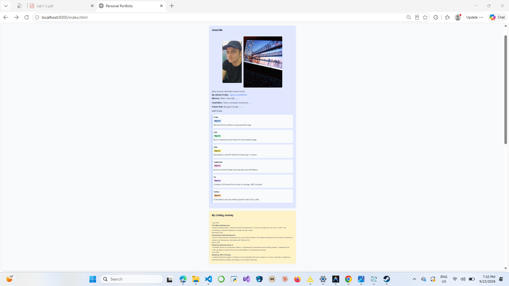
*Making the timeline using CSS pseudo-elements.*

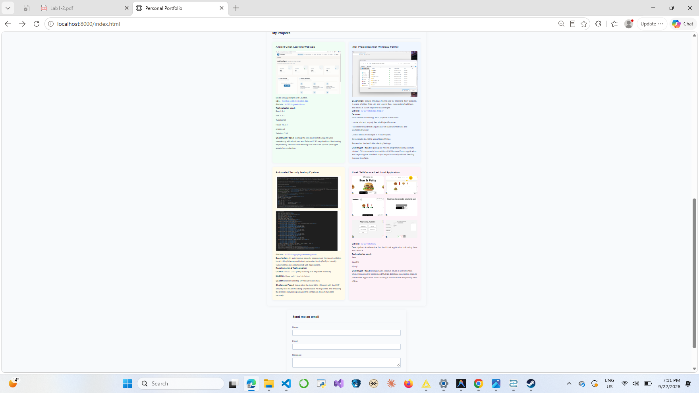
*Adding the skill bars back to the single-page layout.*

**Brief Code Evolution & Timeline Implementation:**
I started out with just a plain `index.html` file. Later, I used CSS Grid to arrange my project cards in a neat 2x2 grid, and I used Flexbox so my images would resize properly on smaller screens. To hit the Grade 3 requirements, I built a "My Coding Journey" timeline. I did this using CSS pseudo-elements (`::before`) to draw the actual line and the dots, which was tricky but meant I didn't have to use external images. Finally, I styled the visual skill bars and added them back into the main page layout.

## 2. Three Technical Challenges

**Challenge 1:**
- **Problem:** When viewing the website on a mobile phone, the 2x2 CSS Grid for my projects caused the project cards to shrink and squish together unreadably.
- **What I tried:** I initially tried shrinking the font size and image width to fit the grid.
- **What solved it:** I used a CSS media query (`@media (max-width: 768px)`) to change the grid layout (`grid-template-columns: 1fr;`), forcing the project cards to stack vertically on small screens.
- **What I learned:** Mobile-first design requires thinking about how blocks of content stack rather than just trying to shrink everything down.

**Challenge 2:**
- **Problem:** I wanted the navigation links to feel like interactive buttons rather than boring underlined text, but standard anchor tags look very plain.
- **What I tried:** I added background colors and padding, but they still didn't respond to the user.
- **What solved it:** I used the `:hover` and `:focus` pseudo-classes to dynamically invert the text color and background color when the mouse moves over the link or the user uses the Tab key.
- **What I learned:** CSS pseudo-classes are powerful tools for providing immediate, tactile feedback to the user without needing JavaScript.

**Challenge 3:**
- **Problem:** Building the vertical "My Coding Journey" timeline from scratch using only CSS.
- **What I tried:** I tried placing images of lines and dots next to my text.
- **What solved it:** I used CSS pseudo-elements (`::before`) to programmatically draw a white dot with an amber border exactly to the left of each timeline item, and an amber `border-left` on the main container to create the continuous line.
- **What I learned:** CSS is capable of drawing complex UI elements (like timelines and shapes) using borders and pseudo-elements, eliminating the need for external images.

---

## 3. Personal thoughts

**What surprised you while building the site?**
I was surprised by how much CSS can do without needing any JavaScript. Features like hover states, responsive collapsing grids, and layouts like the timeline were all achievable just by structuring HTML properly and writing CSS rules.

**Which CSS property or technique caused the most difficulty, and why?**
CSS Grid caused the most difficulty. Understanding the syntax for `grid-template-columns` and how fractions (`1fr`) distribute available space took a lot of mistakes, especially when making sure the layout didn't break on narrow screens. 

**How is the final portfolio different from your first idea?**
Initially, I just wanted a simple top-to-bottom text document with a few images. The final portfolio is much more structured and modern, utilizing color cards, soft shadows, and distinct background colors to separate visually, making it look like a proper webpage rather than a simple document.

---

## 4. Seed Number Integration

I put my assigned seed number (**42**) in the "My Coding Journey" timeline on the main page. Because I got the seed number late, I had to add it in at the very end. To make it fit naturally, I added a new timeline event called **"Day 42 of 100 Days of Code"**, where I talked about finishing the new layout on my 42nd day of coding practice. This way, the number actually makes sense in my portfolio instead of just being randomly pasted somewhere at the end.
